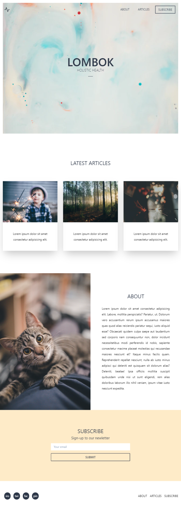

# 🎏 Challenge HTML 10
Desktop
  
Mobile
  

## 🎏 ¿En qué consiste?

Debes replicar el siguiente mockup responsivo usando [Tailwind CSS](https://tailwindcss.com/).

> * Nota 1: Puedes usar [Tailwind.run()](https://tailwind.run/new) para hacer tu maquetación sin necesidad de hacer la instalación.

> * Nota 2: Si tienes dudas respecto a Tailwind CSS, te invito a que hagas nuestro [curso en Platzi](https://platzi.com/clases/tailwind-css/) !

<kbd>

</kbd>

[Fuente del diseño](https://creativemarket.com/delightful.design/2798793-UI-Kit-Lombok)

## 🎏 Pasos a seguir:

1. Hacer un "Fork" de este proyecto.

2. Revolver el reto.

3. Crear un Pull Request hacia este repositorio.

## Contributing
Pull requests are welcome. For major changes, please open an issue first to discuss what you would like to change.

Please make sure to update tests as appropriate.

## License
[MIT](https://choosealicense.com/licenses/mit/)
